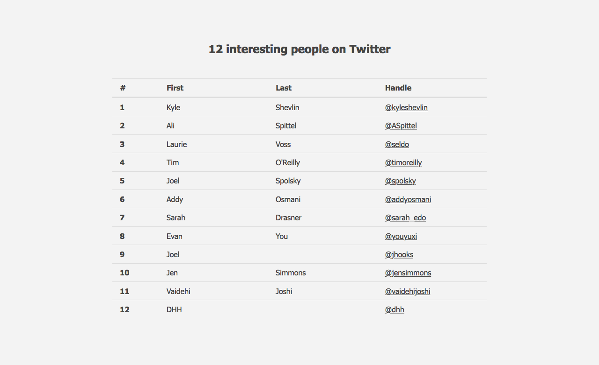
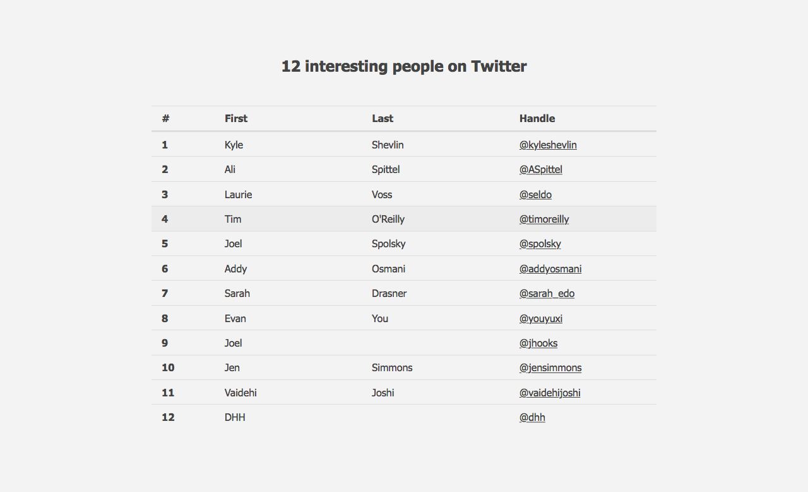
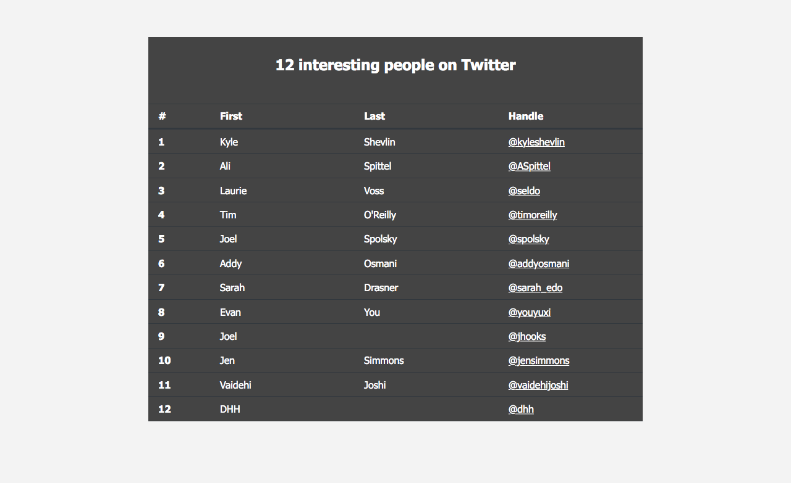
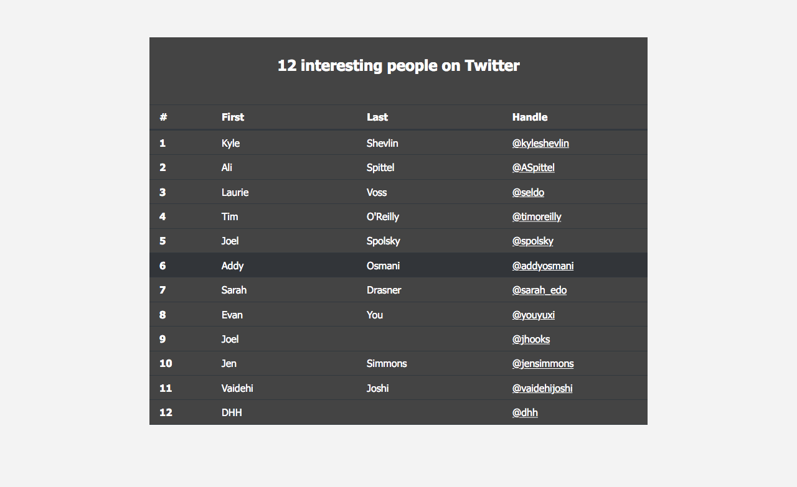

# Table

Create a table that looks like the example picture:





* Links should be clickable, they should have their own hover effect
* Rows will be highlighted on hover
* Can you make 1st column not so wide?

Table data:

```csv
id, First, Last, Handle (link)
1,Kyle,Shevlin,@kyleshevlin (link to https://twitter.com/kyleshevlin)
2,Ali,Spittel,@ASpittel (https://twitter.com/ASpittel)
3,Laurie,Voss,@seldo (https://twitter.com/seldo)
4,Tim,O'Reilly,@timoreilly (https://twitter.com/timoreilly)
5,Joel,Spolsky,@spolsky (https://twitter.com/spolsky)
6,Addy,Osmani,@addyosmani https://twitter.com/addyosmani
7,Sarah,Drasner,@sarah_edo https://twitter.com/sarah_edo
8,Evan,You,@youyuxi(https://twitter.com/youyuxi)
9,Joel,,@jhooks (https://twitter.com/jhooks                      
10,Jen,Simmons,@jensimmon (https://twitter.com/jensimmons)
11,Vaidehi,Joshi,@vaidehijoshi (https://twitter.com/vaidehijoshi)
12,DHH,,@dhh (https://twitter.com/dhh)
```

## Extra:

Let's theme it:





At the end we want to have 2 classes, one default and one for the theme.